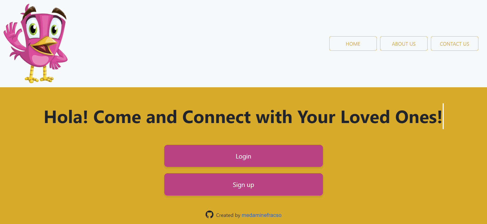

# Hola !
Real-time Chat & responsive web application (Mobile, Tablet, Desktop & larger screens)

<p align="center">
  
</p>

## Home page
<p>
  
</p>

## Features

* Instant messaging : Chatroom where many users can exchange text messages instantly.
* Authentication mechanism for users - with Spring Security

## Technical Stack

- Angular
- Bootstrap 5 for web design
- Spring Boot
- MySQL database

## Technical Details

### Registration mechanism
Username and email should be unique, so that the registration can pass.
- **HTTP 200 OK:** if user is registred
- **HTTP 409 Conflict:** if either username or email already used in another account <br/>

A client-side form validation is performed. The submit button is
disabled if forms values do not respect validation rules. An error
message is displayed to inform the user about the specific error in the
input value.

Once JWT token is generated, it is stored in a httpOnly cookie. <br/>
Note that passwords are hashed in the database.

### Login mechanism details
Username can login by typing :
- Username or Email
- Password

HTTP status returned :
- **HTTP 200 OK:** if user is logged in successfully
- **HTTP 401 Unauthorized:** if credentials inserted by the user are incorrect <br/>

Once JWT token is generated, it is stored in a httpOnly cookie. this cookie is used
to prevent cross-site scripting (XSS) attacks.

### Chat page access restriction
- When a client tries to access the chat page via ```/chat``` route, the
guard checks if user is connected by sending a GET request to the backend. Then,
the guard either allows or blocks access to the chat route base on the
HTTP response.
The server checks if the JWT auth cookie exists and is not expired.

### Chat room
- Users must be authenticated to join the chat room. If a user is not authenticated,
```/chat``` route guard will prevent him from accessing the chat room.
- Users already in the chatroom are notified when a new user join/leave the chat room.
- Also, users have the option to use a specific username when joining the chat room.